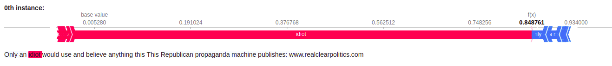

<div align="center">    
 
# Is Explanation All You Need?     

[](https://www.nature.com/articles/nature14539)
[](https://papers.nips.cc/book/advances-in-neural-information-processing-systems-31-2018)  
<!--
ARXIV   
[](https://www.nature.com/articles/nature14539)
-->


<!-- 

Conference   
-->   
</div>
 
## Description   
This repository contains the authors' implementation used in the paper.

#### Abstract:

> *This paper discusses different approaches to the Toxic Spans Detection task. The problem posed by the task was to determine which words contribute mostly to recognising a document as toxic. As opposed to binary classification of entire texts, word-level assessment could be of great use during comment moderation, also allowing for a more in-depth comprehension of the model's predictions. As the main goal was to ensure transparency and understanding, this paper focuses on the current state-of-the-art approaches based on the explainable AI concepts and compares them to a supervised learning solution with word-level labels. The work consists of two xAI approaches that automatically provide the explanation for models trained for binary classification of toxic documents: an LSTM model with attention as a model-specific approach and the Shapley values for interpreting BERT predictions as a model-agnostic method. The competing approach considers this problem as supervised token classification, where models like BERT and its modifications were tested. The paper aims to explore, compare and assess the quality of predictions for different methods on the task. The advantages of each approach and further research direction are also discussed.*

#### Results:

Method | span-level f1
------------ | -------------
OrthoLSTM  | 0.4970
SHAP |  0.5987
BERT | 0.6513
XLNet  | 0.6624
BERT + aug 0.5 + fill 1 | 0.6780
Ensemble |  0.6859

## Prerequisites
First, install dependencies   
```bash
conda env create --file environment.yml
 ```   

For logging to Comet.ML create `config.ini` in the main directory:
```ini
[cometml]
apikey = mySecretKey
projectname = myProjectName
workspace = workspaceName
```

The whole CivilComments dataset can be downloaded from [Kaggle](https://www.kaggle.com/c/jigsaw-unintended-bias-in-toxicity-classification/data).

## Methods
#### OrthoLSTM
LSTM with orthogonalized attention vectors. The implementation from [Interpretable-Attention](https://github.com/akashkm99/Interpretable-Attention) was used and is placed under [project/Transparency](./project/Transparency).

#### SHAP
SHAP was used to explain the model from [Detoxify](https://github.com/unitaryai/detoxify). Implementation is placed under [./project/binary_bert](./project/binary_bert)
The notebook contains every necessary data. Example explanation:


#### Transformers
The training script is in [project/span_bert/][./project/span_bert].


### Citation   
```
@article{YourName,
  title={Your Title},
  author={Your team},
  journal={Location},
  year={Year}
}
```   